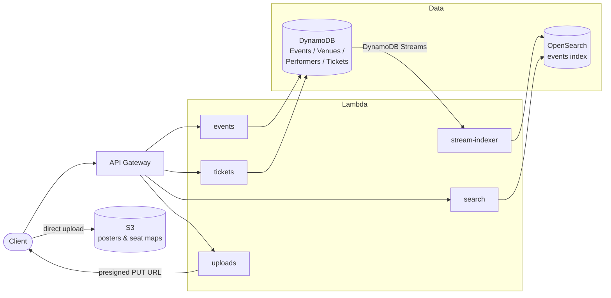

# Ticket Booking Service

A serverless ticket-booking backend built on **AWS Lambda + DynamoDB**, featuring
TTL-based optimistic seat locking, near-real-time full-text search via
**Amazon OpenSearch**, and direct-to-**S3** asset uploads with presigned URLs.

## Architecture



All infrastructure is defined as code in [template.yaml](template.yaml) (AWS SAM).

## Key design decisions

### 1. TTL-based optimistic seat locking (no distributed lock server)

Reserving a seat is a single **conditional write** to DynamoDB — no Redis, no
lock table, no transactions:

```
ConditionExpression:
  status = AVAILABLE  OR  (status = HELD AND holdExpiresAt <= now)
UpdateExpression:
  SET status = HELD, holdExpiresAt = now + 600, heldBy = userId
```

- **Correctness under contention** — DynamoDB evaluates the condition
  atomically, so when N users race for one seat exactly one write succeeds;
  the rest get `ConditionalCheckFailedException` and the API returns `409`.
- **Self-healing holds** — a hold carries its own expiry timestamp. If the
  user abandons checkout, the seat becomes reservable again the moment the
  TTL passes, with no cleanup job or lock-release call required.
- **Ownership checks** — confirming a purchase requires
  `status = HELD AND heldBy = userId AND holdExpiresAt > now`, so a hold can
  only be converted to a sale by the user who owns it, while it is still live.

See [src/handlers/tickets.js](src/handlers/tickets.js).

### 2. Search: DynamoDB Streams → OpenSearch with custom analyzers

DynamoDB stays the system of record; a stream-triggered Lambda
([stream-indexer.js](src/handlers/stream-indexer.js)) mirrors every event
insert/update/delete into an OpenSearch index, so the write path never touches
OpenSearch and search results stay near-real-time.

The [index definition](opensearch/events-index.json) uses custom analyzers:

| Analyzer | Purpose |
|---|---|
| `edge_ngram` (1–20) at index time | search-as-you-type: `"ham"` matches **Hamilton** |
| `synonym_graph` at search time | `"concert"` also matches *gig*, *show*, *performance* |
| `multi_match` + fuzziness | typo tolerance across name / genre / performer |

### 3. Presigned S3 uploads

Event posters and venue seat maps upload **directly from the client to S3**.
The API ([uploads.js](src/handlers/uploads.js)) only validates the request
(content type and asset kind allowlists) and signs a short-lived PUT URL —
file bytes never pass through Lambda or API Gateway, which removes payload
size limits and keeps time-to-first-byte low.

## API

| Method | Path | Description |
|---|---|---|
| `POST` | `/events` | Create event + auto-seed one ticket per venue seat |
| `GET/PUT/DELETE` | `/events/{eventId}` | Event CRUD |
| `GET` | `/events/{eventId}/tickets?status=AVAILABLE` | List tickets (expired holds shown as available) |
| `POST` | `/tickets/hold` | Reserve a seat for 10 min (optimistic conditional write) |
| `POST` | `/tickets/confirm` | Convert an owned, live hold into a sale |
| `POST` | `/tickets/release` | Voluntarily release a hold |
| `GET` | `/search?q=...` | Full-text search (synonyms + fuzziness) |
| `GET` | `/search/autocomplete?q=...` | Prefix suggestions (edge-ngram) |
| `POST` | `/uploads` | Get a presigned S3 PUT URL for a poster / seat map |
| `POST` / `GET/PUT/DELETE` | `/venues`, `/venues/{venueId}` | Venue CRUD |
| `POST` / `GET/PUT/DELETE` | `/performers`, `/performers/{performerId}` | Performer CRUD |

### Example: reserving a seat

```bash
# 1. Hold the seat (starts a 10-minute TTL lock)
curl -X POST $API/tickets/hold \
  -d '{"eventId": "EVT-001", "ticketId": "SEAT-0042", "userId": "user-123"}'
# → 200 { "message": "Ticket held", "holdExpiresAt": 1767000600, ... }
# → 409 if another user holds it

# 2. Confirm the purchase before the hold expires
curl -X POST $API/tickets/confirm \
  -d '{"eventId": "EVT-001", "ticketId": "SEAT-0042", "userId": "user-123"}'
# → 200 { "message": "Purchase confirmed", ... }
```

## Data model

| Table | Key | Notes |
|---|---|---|
| `Events` | `eventId` | Streams enabled → OpenSearch indexer |
| `Venues` | `venueId` | `seats` drives ticket seeding |
| `Performers` | `performerId` | |
| `Tickets` | `eventId` + `ticketId` | `status` ∈ AVAILABLE / HELD / SOLD, `holdExpiresAt`, `heldBy` |

## Project layout

```
src/
  handlers/        one Lambda per API concern
    events.js      event CRUD + ticket seeding (BatchWrite, 25-item chunks)
    tickets.js     hold / confirm / release with conditional writes
    search.js      OpenSearch full search + autocomplete
    uploads.js     presigned S3 upload URLs
    stream-indexer.js  DynamoDB Streams → OpenSearch sync
    venues.js, performers.js
  lib/             shared clients & HTTP helpers
opensearch/        index settings (custom analyzers)
scripts/           one-time OpenSearch index bootstrap
template.yaml      AWS SAM — tables, functions, API routes, S3, stream mapping
```

## Getting started

```bash
npm install

# Deploy all infrastructure (prompts for OpenSearch endpoint/credentials)
sam build && sam deploy --guided

# Create the OpenSearch index with custom analyzers (one-time)
cp .env.example .env   # fill in your OpenSearch endpoint + credentials
npm run create-search-index
```

Credentials are never stored in code: Lambdas use their **IAM execution
role** for DynamoDB/S3, and OpenSearch credentials are injected as SAM
parameters (`NoEcho`) / environment variables.
